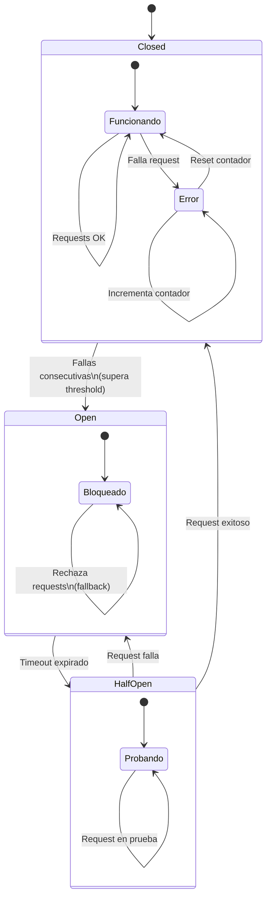

# Microservicios - Gorbienrno Vasco

# Clase Cinco - 27 de Marzo del 2027

# Repaso

* Spring Boot
  * Filtros
* Spring Security
  * HttpBasico
  * JWT
  * OAuth
    * Microservicio ---> Microservicio : CLIENT_CREDENTIALS
    * Usuario Final -----> Web APP(clientID/ClientSecret) ------> Microservicio ---- > Auth-server : AUTHORIZATION_CODE

# Buenas Practicas

* Los controlles NO tienen logica de negocio
* MUY BUENO OSCAR
 	 * Cual el tamanio de un microservicios
	 * Compromiso Practicidad, velocidad y la arquitectura de refencia de mini-microservicios
		  * La arquitectura de microservicios teoric suele "despreciar" las velocidades de coneccion en pos del mantenimiento (deplagar un servicio y que cambie)
	 * No es lo mismo pensar una solucion desde cero que trabajar con una bases ya legada
		  * Posibilidad de Hacer un JOIN (Lo resuelvo en el mismo microservicio)
	      * Tener dos microservicios distintos (Uno trae una parte de la tabla y el otro trae de la otra) 
* Pensar una arquitectura Microservicios
	* Antes : Servicio REST (Generar Factura) (MAs hibrido)
		 * Este Servicio Graba en la base de datos y ademas tiene un monton de logica brutal  (Controllers+servicio+Persitencia+todo)
	     * Si vemos el compilado pesa 500MB
   * Despues: Paso a tener Varios Microservicios (Mas Jedi de Microservicios)
	   * Generar Factura
       * Calcular Impuestos (Otro Endpoint)
		       * Si el dia de maniana cambia el calculo de los impuestos solamente despliegando este servicio se actualiza todo 
       * Validar Cliente (Otro Endpoint)
       * ....
* Es comun encontrar en arquitecturas microservicios a nivel base de datos
	* (id, ...., url_cliente <<< Donde dice url_cliente  servicio-clientes/clientes/1
		 * servicio_clientes es el nombre del serivcio tal cual lo cargas en el Eureka

*  (ciudadano) --> (web JSP) --> (servicio)
*  (ciudadano) --> (web REACT) --> (Micro-servicio /BFF [Backend for Frontend] ) --> (Micro-servicio [De Negocio])  //Codicionado al caso de si conviene cada caso dado que tenmos una estructura legacy y y a una base datos

	*  (Micro-servicio /BFF [Backend for Frontend] )
		 *  Este microservicio esta pensado en el fronted especifico que lo va a consumir
	     *  Muchas veces los desarrolladores frontend terminan en su codigo convirtiendo los datos que ingresa el usuario en una estructura JSON que el servicio de negocio espera (y es bastante codigo/ no es trivial muchas veces)
         * En lugar de hacer esa adaparacion en el frontend pensar la posibilidad de tener un serivcio que haga toda esa adaptacion, librar de eso al frontend y que los parametros de ese microservicio BFF sean "Comodos" para el programador del frontend.
         * Otra... Mas importante todavia..(bien ahi diste en el clavo OIER)... Que el fontend tenga 20 llamadas a microservicios par a hacer algo y se reemplaze por una sola llamada al BFF y que ese sea el que lo redistribuya  

# Documentacion

* Cremos un proyecto con la libreria "SpringDoc OpenAPI"
* Se accede a la documentacion en

```
http://localhost:8080/swagger-ui/index.htm
```

* Ejemplo de Clase documentada

```
package org.gobvasco.cursomsa.documentation.controllers;

import org.springframework.web.bind.annotation.GetMapping;
import org.springframework.web.bind.annotation.RestController;

import io.swagger.v3.oas.annotations.Hidden;
import io.swagger.v3.oas.annotations.Operation;
import io.swagger.v3.oas.annotations.tags.Tag;

@RestController
@Tag(name="DemoController", description="Este es un controlador de prueba")
public class DemoController {

	@GetMapping("/docu")
	@Operation(summary="Una operacion de prueba para mostrar la docummentacion")
	public String demodoc() {
		
		return "Esta es una demo para mostrar la swagger";
	}
	
	@GetMapping("/oculto")
	@Hidden
	public String oculto() {
		
		return "Esta es una demo para mostrar la swagger, pero esto esta oculto";
	}	
}
```

* Me imagino que se debe poder generar automaticamente los controladores a patir de...

```
http://localhost:8080/v3/api-docs
```

> el online lo quitaron, parece que ahra en un ejecutable y parece de pago ademas
https://github.com/swagger-api/swagger-codegen
https://swagger.io/tools/swagger-codegen/
aqui lo tienen y para lo de openAPI que decia Jose Manuel:
https://learn.openapis.org/
es la especificación para generar codigo a partir del yml para crear los controllers, genera interfaces para los controllers (Gracias JON)

* Hay coniguraciones para solo dejar hacer gets

```
springdoc.swagger-ui.supported-submit-methods=get
```

# Api Gateway

* Si bien para el ejemplo vamos a utilizar una api de SpringBoot
	* Puede ser util para agregar filtos al proyecto
* Tambien tenemos miles de soluciones para implementar gateways (con load balancer e incluso autenticacion)
	* https://nginx.org/
 * Crear en Spring Initializr
	  * Reactive Gateway
	  *  (No incluir Spring Web)
*  Este gateway usa programacion reactiva para ser mas eficiente (Http no bloqueante)
	*  https://www.rxjava.com/
* Este gateway generalmente esta instalado un servidor fontera que tiene salida a Internet y el resto de los servicios estan en el boundary de una red interna

* El application.yml me quedaria asi:
 
```yml
server:
  port: 9005 

spring:
  application:
    name: gateway
  cloud:
    gateway:
      server:
        webflux:
          routes:
            - id: documentation
              uri: http://localhost:8080
              predicates:
                - Path=/docu,/docu/** 
```

* En produccion voy a tener prefihos no asi (es una archivo bastante extenso que generalente va direcamente en el config server)

```yml
              predicates:
                - Path=/api/ciudadanos/**

             ...

              predicates:
                - Path=/api/tramites/** 

             ...

			  predicates:
                - Path=/api/reglamentaciones/** 

             ....

             predicates:
                - Path=/api/etc/** 

```

* Compruebo que da igual acceder a...

```
http://localhost:8080/docu
```

* Que a...

```
http://localhost:9005/docu
```

# Revision de Pendiente

---

## Vimos esto: 

- Documentación de APIs (OpenAPI / Swagger)   <<<<<<<<<< LO VIMOS
- Gestión de migraciones (Flyway o Liquibase) <<<  Iba en la clase de JPA.  <<<< https://github.com/estebancalabria/java/tree/main/Labs/SpringBoot/LAB-0530-SPRING-JPA-Migrations-Flyway  


- De esto estuvimos hablando largo y tentido es conceptual
  - MÓDULO 6. ARQUITECTURA DE MICROSERVICIOS
     - Evolución de arquitecturas: monolito vs microservicios
     - Arquitecturas híbridas
     - Principios de diseño de microservicios
    - Patrones clave: API Gateway, Configuración


## Vamos a finalizer con esto


Service Discovery
MÓDULO 5. GESTIÓN Y MONITORIZACIÓN
- Introducción a Spring Boot Actuator
- Endpoints de monitorización
- Métricas y health checks
- Configuración de logs
- Logging estructurado
- Gestión de perfiles en producción
- Buenas prácticas de observabilidad

>>>> Si tengo 3 microservicios como se en springboot como sigo un flujo de negocio como identifico la llamada desde el punto 1 al punto 3. Una estrategia. 

>>> Circuit Breaker  <<<<<<<< ME OLVIDE... AL FINAL LES COMENTO

---

# Descubrimento de Servicios

* Crea el servidor de eureka en spring initializ con Eureka Server

* Agregar la anotacion @EnableErekaServer a la clase ppal

```java
package org.gobvasco.cursomsa.discovery_server;

import org.springframework.boot.SpringApplication;
import org.springframework.boot.autoconfigure.SpringBootApplication;
import org.springframework.cloud.netflix.eureka.server.EnableEurekaServer;

@SpringBootApplication
@EnableEurekaServer
public class DiscoveryServerApplication {

	public static void main(String[] args) {
		SpringApplication.run(DiscoveryServerApplication.class, args);
	}

}

```

* Configurar propiedades en application.properties

```
server.port=8761
eureka.client.register-with-eureka=false
eureka.client.fetch-registry=false
```

* Luego ir a la Web

```
http://localhost:8761/
```

* Crear con Spring initalizer un servicio que se registre solo en el servidor eureka
	* Eureka Client
	* Spring Web
    *... 

* Configurar la conexion eon el server (debe hacer un post a esa url para registrarse)

```
eureka.client.service-url.defaultZone=http://localhost:8761/eureka
```

* Configurar la inyeccion de dependencias del restClient con el decorador @LoadBalanced para que por detras se comunique con el servidor Eureka y lo use como una suerte de DNS para convetir direccion htttp://servicio ---> htto://localhost:8080 de forma transparente

```java
package org.gobvasco.cursomsa.discovery_client.configuration;

import org.springframework.cloud.client.loadbalancer.LoadBalanced;
import org.springframework.context.annotation.Bean;
import org.springframework.context.annotation.Configuration;
import org.springframework.web.client.RestTemplate;

@Configuration
public class AppConfig {
	
	@Bean
	@LoadBalanced  
	//ESta anotacion hace que cuando hago un request de la forma http://servicioa
	//Por detras sin que lo note hace un request al server de eureka y tranforma
	//http://servicioa ----> http://localhost:8080
	//Es como un DNS transparente
	public RestTemplate restTemplate() {
		return new RestTemplate();
	}

}
```

* Agregar un controlador para probar el descubrimiento de servicios

```
package org.gobvasco.cursomsa.discovery_client.controllers;

import org.springframework.beans.factory.annotation.Autowired;
import org.springframework.web.bind.annotation.GetMapping;
import org.springframework.web.bind.annotation.RestController;
import org.springframework.web.client.RestTemplate;

@RestController
public class DatosController {

	@Autowired
	RestTemplate restTemplate;
	
	@GetMapping("/datos")
	public String dameDatos() {
		return "Datos desde el servicio a");
	}
	
	@GetMapping("/datos-indirecto")
	public String datosIndirecto() {
		//Esto lo pondria en otro servicio, pero lo hago en este espero que se entienda, para no tener que crear otro prouecto
		//http://discovery-clien NO es una URL real
		//gracias al #LoadBalanced, Spring consuta a Eurka de forma transparente y devuelve algo como http://localhost:8080
		String llamadaUsandoEureka = this.restTemplate.getForObject("http://discovery-client/datos", String.class);
		return "Usando el servidor eureka se devuelve " + llamadaUsandoEureka;
	}
	
}
```

* Ejecutar el servidor y luego el cliente

* Voy a ver que el cliente se regista en el servidor de eureka si consulto

```
http://localhost:8761/

```

* Verificar las invocaciones

```
http://localhost:8080/datos
http://localhost:8080/datos-indirecto
```

* Al hacer la segunda invocacion (Cliente) -> (Servicio) ---> [restTemplate] ---> (eureka server) ---> [Traduce la URL con nombre servicio a ip fisica] --> (Servicio)

* Si el dia de maniana cambio la ubicacion o el puerto del servicio, el servicio se vuelve a registrar con Eureka con el mismo nombre y los clientes no cambian porque no necesitas saber ni ubicaciones fisica, ni puertos, solo nombres de servicios
* Podemos integrar lo que vimos y en spring intializr si creamos un proyecto con api gatewat y eureka client deberiamos escribir una condiguracion asi :

```
  cloud:
    gateway:
      server:
        webflux:
          routes:
            - id: documentation
              uri: lb://discovery-client
              predicates:
                - Path=/docu,/docu/** 
```

* El Eureka server em general en la Red Privada (no tien salida a internet)
* Es ideal tener uno para toda la organizacion
	* Pero entiendo que desde el punto de vista operativo puede ser un problema si hay varios equipos y proyectos distintos en cuanto a coordinacion
	* Perro es factible tener uno por proyecto, el tema es si el mismo microservicio esta en dos proyectos cuidado con el tema de los nombres

# Monitoreo

* Aspectos a considerar
	* Monitoring por defecto que viene con Java (Niveles de logging) ----> Mas que nada en desarrollo
		 * Niveles de logging : ERROR, INFO, VERBOSE, TRACE
		 * El problema de los monitoring por defecto es cuando pasamos a produccion. No es tan facil ver la consola y cabiar los niveles de logging
   * El tema del monitoring por defecto es cuando vamos a produccion ----> En ese caso la solucion de montoring es el Actuator
   
   * Ahora vemos la pregunta que me hicieron : Correlacion entre Microservicios
	   *  Si tengo 3 microservicios como se en springboot como sigo un flujo de negocio como identifico la llamada desde el punto 1 al punto 3. Una estrategia.
      *  (Servicio a)  -> (Servicio B) -> (Servicio c)
      *  En el algun punto algo falla. Como lo debuggeo?
	      * Puedo ver el actuator del Servicio a, de Servicio B, del Servicio C y la realidad es que tal vez no alcanza para darme cuenta el problema
          * Necesito ver la pila de llamadas a nivel microservicios y eso no me lo solucona ni el logging de java ni actuator
		          * Debe haber alguna libreria para  solucionar estyo pero en mi caso no la conozco
          * Solucion propuesta por el profe
		          * Agregar en los servicios un filtro que procese el request y le agregue un header por donde va pasando

```
//Lees del header el "X-Stack-Trace" que viene
String stackActual = leerHeader("X-Stack-Trace")

//En la respuesta
HttpHeader header = nre HttpHeader
header.set("X-Stack-Trace", stackActual +"ServicioQueEstoyInvocando")
```

       * Seguramente hay alguna manera de logging distribuido mejor pero se las debo....
            
* Si es a nivel de entender el comportamiento del usuario pensando en su uso desde una pagina web
	 * Si necesito un producto
	 * Por ejemplo en azure esta el application insights
	 * Producto a nivel despliegue 
 
* Crear un proyecto con
 	 * Sprinb Web
	 * Dev Tools
     * Sprinboot Actuator

* Crear un controlador para ver logging y demas

```java
package org.gobvasco.cursomsa.actuator_demo.controllers;

import org.slf4j.Logger;
import org.slf4j.LoggerFactory;
import org.springframework.web.bind.annotation.GetMapping;
import org.springframework.web.bind.annotation.RestController;

@RestController
public class DemoController {
	
	public static final Logger log = LoggerFactory.getLogger(DemoController.class)

	@GetMapping("/demo")
	public String demo() {
		
		log.info("Se incoa al servicio");
		try {
			log.warn("Voy  a lanzar una excepcion de prueba, ojo!");
			throw new RuntimeException("Excepcion forzada");
		} catch (Exception e) {
			log.error("Aca capturo el error");
		}
		
		return "Servicio invodado";
	}
}

```

* Probar el controlador y ver los distintos endpoints de actuator (imagenos un escenario donde estamos en produccion)
 	* http://localhost:8080/actuator/health

* Ver lla documentacion de Actuator (Perdon no me funciono) para configurar el archivo application.properties
```
///Pendiente
```

* Se pueden consultar los logs mediante la URL (consultar los logs de la clase demo controller si esta activado)

```
http://localhost:8080/actuator/loggers/org.gobvasco.cursomsa.actuator_demo.controllers.DemoController
```

* Puedo cambiar el nivel de logging mediante una request

```
curl -X POST -H "Content-Type: application/json" \
    -d '{"configuredLevel":"DEBUG"}' \
    http://localhost:8080/actuator/org.gobvasco.cursomsa.actuator_demo.controllers.DemoController
```

* Puedo de esta maenera hacer un debuggeo en produccion

* Ver : https://www.baeldung.com/spring-boot-actuators

#  Circuit Breaker  




* El patron de microservicios Circuit Breaker se implementa con resilence4j
* Que hacer si un servicio esta caido, reintentar o devolver un mesaje de error

> https://resilience4j.readme.io/

```
// Create a CircuitBreaker with default configuration
CircuitBreaker circuitBreaker = CircuitBreaker
  .ofDefaults("backendService");

// Create a Retry with default configuration
// 3 retry attempts and a fixed time interval between retries of 500ms
Retry retry = Retry
  .ofDefaults("backendService");

// Create a Bulkhead with default configuration
Bulkhead bulkhead = Bulkhead
  .ofDefaults("backendService");

Supplier<String> supplier = () -> backendService
  .doSomething(param1, param2)

// Decorate your call to backendService.doSomething() 
// with a Bulkhead, CircuitBreaker and Retry
// **note: you will need the resilience4j-all dependency for this
Supplier<String> decoratedSupplier = Decorators.ofSupplier(supplier)
  .withCircuitBreaker(circuitBreaker)
  .withBulkhead(bulkhead)
  .withRetry(retry)  
  .decorate();

// When you don't want to decorate your lambda expression,
// but just execute it and protect the call by a CircuitBreaker.
String result = circuitBreaker
  .executeSupplier(backendService::doSomething);

// You can also run the supplier asynchronously in a ThreadPoolBulkhead
 ThreadPoolBulkhead threadPoolBulkhead = ThreadPoolBulkhead
  .ofDefaults("backendService");

// The Scheduler is needed to schedule a timeout 
// on a non-blocking CompletableFuture
ScheduledExecutorService scheduledExecutorService = Executors.newScheduledThreadPool(3);
TimeLimiter timeLimiter = TimeLimiter.of(Duration.ofSeconds(1));

CompletableFuture<String> future = Decorators.ofSupplier(supplier)
    .withThreadPoolBulkhead(threadPoolBulkhead)
    .withTimeLimiter(timeLimiter, scheduledExecutorService)
    .withCircuitBreaker(circuitBreaker)
    .withFallback(asList(TimeoutException.class, 
                         CallNotPermittedException.class, 
                         BulkheadFullException.class),  
                  throwable -> "Hello from Recovery")
    .get().toCompletableFuture();
```

