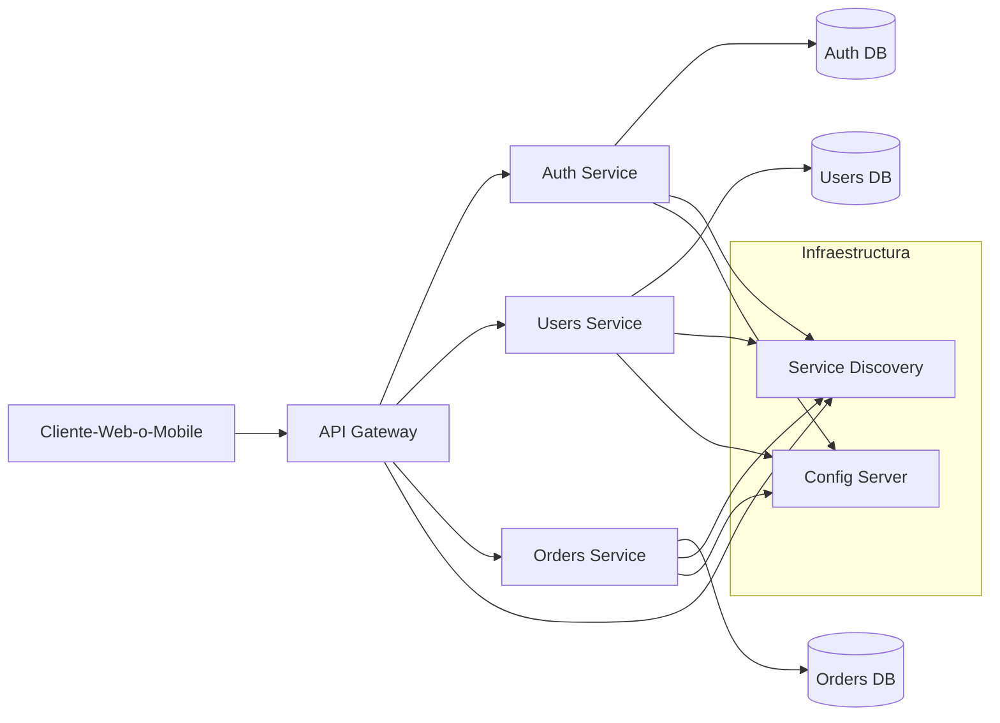

# Gobierno Vasco

# Spring Boot y Arquitectura Micro Servicios - Clase Uno - 23 de Marzo 2025

# Programa del Curso

* Diferencias entre Spring clasico y Spring Boot
* Arquitectura de Microservicios
  * Buenas practicas
  * Patrones de Microservicios
  * Descubrir Servicios
  * Seguridad
  * Manejo de Errores
  * Configuracion
* Protocolo HTTP
* Fundamentos de Spring boot
* Desarrollos de Apis en Spring Boot
* Arquitectura de Refencia
    * Controlador
    * Servicio
    * Modelo
    * DTO
    * Persistencia
* Comunicacion entre servicios
    * Sicronica vs Asincronica
    * RestTemplate y WebClient
* Configuracion de Microservicios
  * Servidor de Configuracion
* Dependencias populares de SpringBoot
* Persistencia y JPA
  * Usamos una base como SQLITE https://sqlite.org/
* Transaccionalidad
  * Patron SAGA (mencionar)
* Seguridad (Spring Security)
  * OAuth2
  * JWT
* Monitoring y Log (Actuator)
* Descubrimiento de Microservicios
    * Eureka
* Putno de entrada
  * Api Gateway

# Grafico arqutiectura Microservicios



# Spring Clasivo vs Spring Boot

* La configuracion de TODO se hace generalmente con anotaciones en lugar de archivos xml
    * Spring Boot soluciona el tema del infierno XML que teniamos co Spring
  
# Inicializacion Entorno

* Creacion de nuestro primer "Hola Mundo" en SpringBoot
* Ir a https://start.spring.io/
    * Aca vamos a crear en esta pagina nuestro proyecto de spring boot
* Verificar la version de java

```
java --version
```

* Abrir el eclipse y elegir una carpeta para el workspace
*  Vamos acrear un proyecto
    *  Nombre del paquete: org.gobvasco.cursomsa.claseuno
    *  Depedencias
      *  Spring Web
      *  Spring Boot Dev Tools
*  Al poner Generate Descarga un zip
*  Descomprimir el zip en la carpeta de Worskpace
*  File...Import...Maven... Existing Maven Project
*  Boton Derecho protecto...Run As... Java Appilcation...El nombre de la clase Principal

# Crear nuestro primer controlador

* Crear un paquete pero que termine con Controller
* Crear una clase Persona Controller dentro de ese paquete
* Agregar a la clase la anotacion/decorador @RestController
* Agregar el metodo HolaMundo que devuelve un String con la anotacion @GetMapping("/holamundo")

## @GetMapping

```java
package org.gobvasco.cursomsa.claseuno.controllers;

import org.springframework.web.bind.annotation.GetMapping;
import org.springframework.web.bind.annotation.RestController;

@RestController
public class PersonaController {
	
	@GetMapping("/holamundo")
	public String holaMundo() {
		return "Hola Mundo";
	}

}
```

## @RequestParam

```java
package org.gobvasco.cursomsa.claseuno.controllers;

import org.springframework.web.bind.annotation.GetMapping;
import org.springframework.web.bind.annotation.RequestParam;
import org.springframework.web.bind.annotation.RestController;

@RestController
public class PersonaController {

//...	

	@GetMapping("/saludar")
	//public String saludar(@RequestParam String nombre) { 
	/*public String saludar(@RequestParam(required=false) String nombre) {
		return (nombre==null) ? "Hola desconocido" : "Hola "+nombre;
	}*/
	public String saludar(@RequestParam(defaultValue="desconocidooo") String nombre) {
		return "Hola "+ nombre;
	}

}

```

## @PathVariable

```java
package org.gobvasco.cursomsa.claseuno.controllers;

import org.springframework.web.bind.annotation.GetMapping;
import org.springframework.web.bind.annotation.PathVariable;
import org.springframework.web.bind.annotation.RequestParam;
import org.springframework.web.bind.annotation.RestController;

@RestController
public class PersonaController {
	
	
	@GetMapping("/saludo/{nombre}")
	public String saludo(@PathVariable String nombre) {
		return "Hola " + nombre;
	}

}

```

## Implementar arquitectura Referencia

* Agregamos paquete servicios (org.gobvasco.cursomsa.claseuno.services)
* Agregamos paqeute dto (org.gobvasco.cursomsa.claseuno.services)
* Crear la clase Persona

```java
package org.gobvasco.cursomsa.claseuno.dto;

public class Persona {
 	private int documento;
 	private String nombre;
 	private String apellido;
 	
 	public int getDocumento() {
 		return documento;
 	}
 	public void setDocumento(int documento) {
 		this.documento = documento;
 	}
 	public String getNombre() {
 		return nombre;
 	}
 	public void setNombre(String nombre) {
 		this.nombre = nombre;
 	}
 	public String getApellido() {
 		return apellido;
 	}
 	public void setApellido(String apellido) {
 		this.apellido = apellido;
 	}
}
```

* Crear la interfaz del servicio

```java
package org.gobvasco.cursomsa.claseuno.services;

import java.util.List;

import org.gobvasco.cursomsa.claseuno.dto.Persona;

public interface IPersonaService {
	List<Persona> getAll();
}

```

* Crear clase Servicio

```java
package org.gobvasco.cursomsa.claseuno.services;

import java.util.ArrayList;
import java.util.List;

import org.gobvasco.cursomsa.claseuno.dto.Persona;
import org.springframework.stereotype.Service;

@Service
public class PersonaService implements IPersonaService {

	public List<Persona> getAll(){
		List<Persona> result = new ArrayList<>();
		
		Persona juan = new Persona();
		juan.setDocumento(1);
		juan.setNombre("Juan");
		juan.setApellido("Perez");
		
		result.add(juan);
		
		Persona maria = new Persona();
		maria.setDocumento(2);
		maria.setNombre("Maria");
		maria.setApellido("Gomez");
		
		result.add(maria);
		
		return result;
	}
}

```

* Crear el dto

```java
package org.gobvasco.cursomsa.claseuno.dto;

public class Persona {
	private int documento;
	private String nombre;
	private String apellido;
	
	public int getDocumento() {
		return documento;
	}
	public void setDocumento(int documento) {
		this.documento = documento;
	}
	public String getNombre() {
		return nombre;
	}
	public void setNombre(String nombre) {
		this.nombre = nombre;
	}
	public String getApellido() {
		return apellido;
	}
	public void setApellido(String apellido) {
		this.apellido = apellido;
	}
}

```

> Tengo la opcion de utilizar la libreria lombok si no quiero tener que declarar getters y setters

* Crear el endpoint en el controller

```java
package org.gobvasco.cursomsa.claseuno.controllers;

import java.util.List;

import org.gobvasco.cursomsa.claseuno.dto.Persona;
import org.gobvasco.cursomsa.claseuno.services.IPersonaService;
import org.springframework.beans.factory.annotation.Autowired;
import org.springframework.web.bind.annotation.GetMapping;
import org.springframework.web.bind.annotation.PathVariable;
import org.springframework.web.bind.annotation.RequestParam;
import org.springframework.web.bind.annotation.RestController;

@RestController
public class PersonaController {
	
	@Autowired
	private PersonaService IPersonaService;
	
	@GetMapping("/persona")
	public List<Persona> getAll(){
		return this.personaService.getAll();
	}

}
```

# Manejo de Status Code HTTP

* Agregar el GetByID del Servicio en la interfaz

```java
package org.gobvasco.cursomsa.claseuno.services;

import java.util.List;

import org.gobvasco.cursomsa.claseuno.dto.Persona;

public interface IPersonaService {
	List<Persona> getAll();
	
	Persona getById(int id);
}

```

* Implementamos el GetById en el servicio

```java
package org.gobvasco.cursomsa.claseuno.services;

import java.util.ArrayList;
import java.util.List;

import org.gobvasco.cursomsa.claseuno.dto.Persona;
import org.springframework.stereotype.Service;

@Service
public class PersonaService implements IPersonaService {
	
	List<Persona> personas = new ArrayList<>();
	
	public PersonaService() {
		Persona juan = new Persona();
		juan.setDocumento(1);
		juan.setNombre("Juan");
		juan.setApellido("Perez");
		
		personas.add(juan);
		
		Persona maria = new Persona();
		maria.setDocumento(2);
		maria.setNombre("Maria");
		maria.setApellido("Gomez");
		
		personas.add(maria);	
	}

	public List<Persona> getAll(){
		return personas;
	}

	@Override
	public Persona getById(int id) {
		// TODO Auto-generated method stub
		if (id > this.personas.size()) {
			//Devolvemos nulo o lanzamos una excepcion
			return null;
		}
		return this.personas.get(id-1);
	}	
}
```

* Implementamos en el controlador

```java
//...

@RestController
public class PersonaController {
	
	//...	
	
	@GetMapping("/persona")
	public List<Persona> getAll(){
		return this.personaService.getAll();
	}
	
	@GetMapping("/persona/{id}")
	public ResponseEntity<Persona> getById(@PathVariable int id){
		
		Persona persona = this.personaService.getById(id);
		

		if (persona==null) {
			return ResponseEntity.notFound().build(); 
		}
		
		return new ResponseEntity<Persona>(persona, HttpStatus.OK);
	}
}


```

## Agregamos un post

* Modifcamos la itnerfaz

```java
package org.gobvasco.cursomsa.claseuno.services;

import java.util.List;

import org.gobvasco.cursomsa.claseuno.dto.Persona;

public interface IPersonaService {
	List<Persona> getAll();
	
	Persona getById(int id);
	
	void add(Persona p);
}

```

* Modificamos el servicio

```java
package org.gobvasco.cursomsa.claseuno.services;

import java.util.ArrayList;
import java.util.List;

import org.gobvasco.cursomsa.claseuno.dto.Persona;
import org.springframework.stereotype.Service;

@Service
public class PersonaService implements IPersonaService {
	
	List<Persona> personas = new ArrayList<>();
	
	public PersonaService() {
		Persona juan = new Persona();
		juan.setDocumento(1);
		juan.setNombre("Juan");
		juan.setApellido("Perez");
		
		personas.add(juan);
		
		Persona maria = new Persona();
		maria.setDocumento(2);
		maria.setNombre("Maria");
		maria.setApellido("Gomez");
		
		personas.add(maria);	
	}

	public List<Persona> getAll(){
		return personas;
	}

	@Override
	public Persona getById(int id) {
		// TODO Auto-generated method stub
		if (id > this.personas.size()) {
			//Devolvemos nulo o lanzamos una excepcion
			return null;
		}
		return this.personas.get(id-1);
	}

	@Override
	public void add(Persona p) {
		// TODO Auto-generated method stub
		this.personas.add(p);
	}	
}

```

* Modifamos el controlador

```java
package org.gobvasco.cursomsa.claseuno.controllers;

import java.util.List;

import org.gobvasco.cursomsa.claseuno.dto.Persona;
import org.gobvasco.cursomsa.claseuno.services.IPersonaService;
import org.springframework.beans.factory.annotation.Autowired;
import org.springframework.http.HttpStatus;
import org.springframework.http.ResponseEntity;
import org.springframework.web.bind.annotation.GetMapping;
import org.springframework.web.bind.annotation.PathVariable;
import org.springframework.web.bind.annotation.PostMapping;
import org.springframework.web.bind.annotation.RequestBody;
import org.springframework.web.bind.annotation.RequestParam;
import org.springframework.web.bind.annotation.RestController;

@RestController
public class PersonaController {
	
	@Autowired
	private IPersonaService personaService;
	
	//...
	
	@PostMapping("/persona")
	public String add(@RequestBody Persona p) {
		this.personaService.add(p);
		return "OK";
	}
}


```

* Todo para no abrir el postman

```cmd
curl -X POST http://localhost:8080/persona -H "Content-Type: application/json" -d "{\"nombre\":\"Esteban\", \"apellido\":\"Calabria\", \"documento\":3}"
```

# Anotaciones SpringBoot

* @RestController
* @GetMapping
* @PostMapping
* @RequestParam
   * @RequestParam(required=false)
   * @RequestParam(defaultValue="<VALOR DEFECTO>")
* @PathVariable
* @Service
* @Autowired
* @RequestBody

# Clases de SpringBoot

* ResponseEntity
* HttpResult
