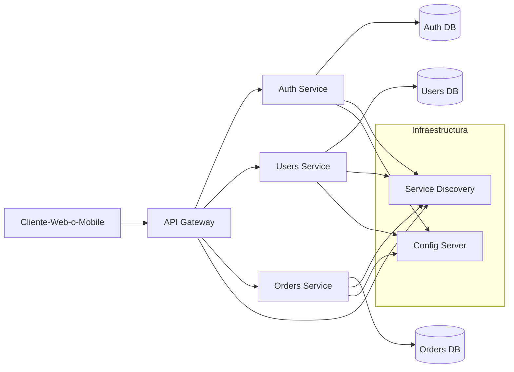

# Gobierno Vasco

# Spring Boot y Arquitectura Micro Servicios - Clase Uno - 23 de Marzo 2025

# Programa del Curso

* Diferencias entre Spring clasico y Spring Boot
* Arquitectura de Microservicios
  * Buenas practicas
  * Patrones de Microservicios
  * Descubrir Servicios
  * Seguridad
  * Manejo de Errores
  * Configuracion
* Protocolo HTTP
* Fundamentos de Spring boot
* Desarrollos de Apis en Spring Boot
* Arquitectura de Refencia
    * Controlador
    * Servicio
    * Modelo
    * DTO
    * Persistencia
* Comunicacion entre servicios
    * Sicronica vs Asincronica
    * RestTemplate y WebClient
* Dependencias populares de SpringBoot
* Persistencia y JPA
  * Usamos una base como SQLITE https://sqlite.org/
* Transaccionalidad
  * Patron SAGA (mencionar)
* Seguridad (Spring Security)
  * OAuth2
  * JWT
* Monitoring y Log (Actuator)
* Descubrimiento de Microservicios
    * Eureka
* Putno de entrada
  * Api Gateway

# Grafico arqutiectura Microservicios



# Spring Clasivo vs Spring Boot

* La configuracion de TODO se hace generalmente con anotaciones en lugar de archivos xml
    * Spring Boot soluciona el tema del infierno XML que teniamos co Spring
  
# Inicializacion Entorno

* Creacion de nuestro primer "Hola Mundo" en SpringBoot
* Ir a https://start.spring.io/
    * Aca vamos a crear en esta pagina nuestro proyecto de spring boot
* Verificar la version de java

```
java --version
```

* Abrir el eclipse y elegir una carpeta para el workspace
*  Vamos acrear un proyecto
    *  Nombre del paquete: org.gobvasco.cursomsa.claseuno
    *  Depedencias
      *  Spring Web
      *  Spring Boot Dev Tools
*  Al poner Generate Descarga un zip
*  Descomprimir el zip en la carpeta de Worskpace
*  File...Import...Maven... Existing Maven Project
*  Boton Derecho protecto...Run As... Java Appilcation...El nombre de la clase Principal
